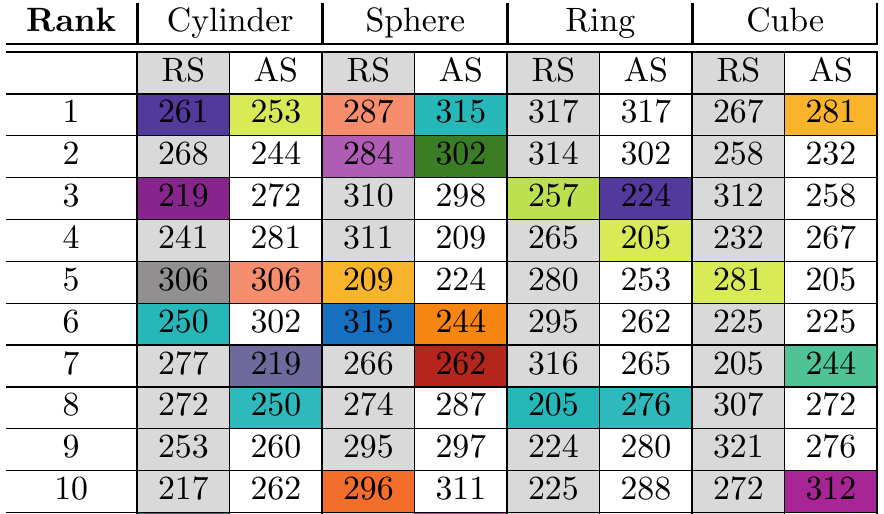

## Event-wise cross decoding in F5

This repository partially contains the code snippets of "Event-wise cross decoding in F5" study. It is aimed to analyze the neural representation of action observation and action execution under four different experimental conditions. In previous study we considered whole firing vector as input matrix, yet in this study cue, "on movement" (reaching) and "grasping" (holding) events data are carefully extracted and cross decoding and [Leave one out cross validation](https://en.wikipedia.org/wiki/Cross-validation_(statistics)) performed on the available neural data set.

> In 2000, Ramachandran made a prediction that "mirror neurons will do for psychology what DNA did for biology: they will provide a unifying framework and help explain a host of mental abilities that have hitherto remained mysterious and inaccessible to experiments." [link](https://en.wikipedia.org/wiki/Vilayanur_S._Ramachandran)

**Method**
-----

Neuronal discharges during each condition were trimmed and represented as 14-bin histogram vectors. In the two neuron analysis, each neuron was reduced to a 7-bin histogram, and their concatenation results in a 14-tuple vector, to ensure similar decoder complexity (constant number of adjustable parameters). Thus, for each condition, ten 14-tuple neural firings (one per trial) made up the rows of the input matrix X,  and the corresponding object ids (1-4) made up the output vector Y. We assumed a linear relation between input and output as XW = Yand solved for the weights (the decoder parameters) using the pseudo-inverse solution W = X†Y. Then, given a 14-tuple vector representation, z, of a discharge, the predicted object id is given by ypred  argmin i=0..5{[0,1,2,3,4,5]−zTW} ypred arg min i 0..5 {0 1 2 3 4 5} z T W, where 0 and 5 indicates a definite wrong prediction. For execution-only and observation-only experiments, leave-one-out cross validation was applied to obtain the success rates in decoding. For cross-decoding analysis, the weight vector W obtained in one condition was used to predict the object type in the other condition by using the data from that condition. (see the paper [cns2016](http://www.biomedcentral.com/1471-2202/16/S1/P190))

## Sample-Result
The table below automatically extracted by the framework. The numbers in each cells are unit ids and colored cells are the units which performs well based on relative and absolute specifity metrics in both action observation and action execution conditions.

